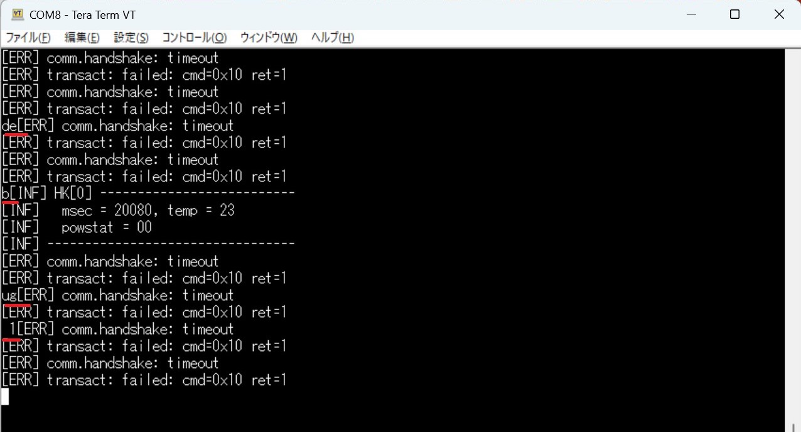

# 簡易RSP-01 Main OBCソフトウェア

本ディレクトリには、第7章のMain OBC用ソフトウェアのソースコードが格納されています。

このソフトウェアは、RSP-01における実装を参考に書き直しを行ったものです。

環境設定・ビルドの方法は[10_Ch7_Sup/sw-c.md](/10_Ch7_Sup/sw-c.md)を参照ください。

## ターミナルでの文字入力

Main OBCにT系OBCが接続されていないか、T系OBCとの接続が不安定な場合、ターミナルには通信失敗を示す以下のようなメッセージが約1秒周期で表示されます:

```text
[ERR] comm.handshake: timeout
[ERR] transact: failed: cmd=0x10 ret=1
```

このとき、キーボードからの入力の取りこぼしが発生しやすくなります。取りこぼしを回避するためには、上記メッセージの合間に1文字ずつ入力してください。

文字入力に成功すると、入力文字がエラーメッセージの間に割り込む形で表示されます。下図は`debug 1`の入力に成功した場合の例です:



入力した文字が表示されない場合は取りこぼしが発生しているので、エラーメッセージの合間に`Ctrl + c`を入力して入力をキャンセルし、再度入力を試みてください。

## 設定の変更

### アームのパラメータ変更

`src/config/config.hpp`には、アームの挙動に関係するいくつかのパラメータが定義されています。必要に応じて変更してください。

- `DRIVE_FORWARD_LIMIT`, `DRIVE_REVERSE_LIMIT`:
  - アーム展開・収納時に、アーム駆動部（書籍図62中の３番パーツで構成される部分）が軸（書籍図62中の25番パーツ）に対してどの程度端まで到達するかを決めるパラメータです。0は完全に展開しきった位置、65535は完全に収納しきった位置を示します。
  - 値の範囲は以下に従ってください:
    - 0以上65535以内
    - 大きさの関係: `DRIVE_FORWARD_LIMIT` < `DRIVE_REVERSE_LIMIT`
  - 例えば、アームの展開長を小さくしたい場合は`DRIVE_FORWARD_LIMIT`をより大きな値にしてください。

- `DRIVE_TIME_MS`: 1回の展開/収納動作に使われる最大継続時間（ミリ秒）。駆動時間が長すぎる・短すぎる場合は変更してください
