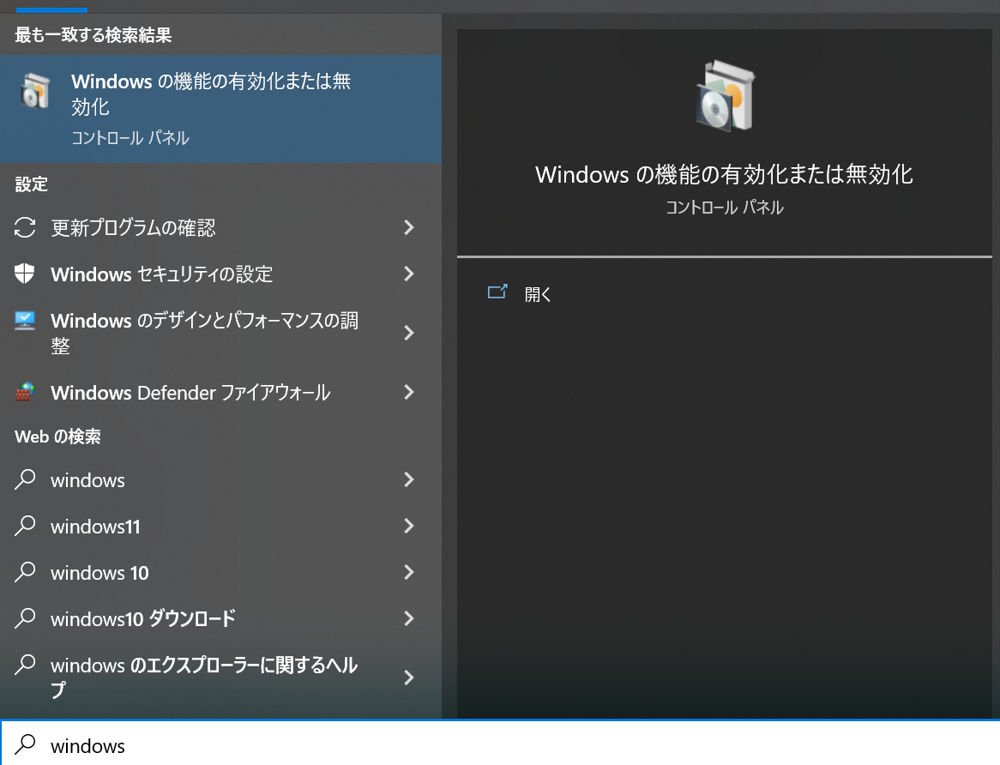
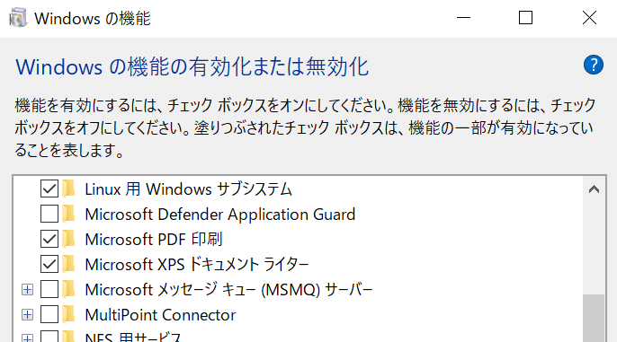
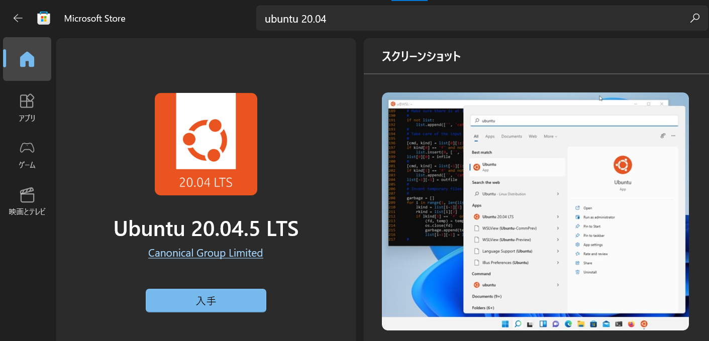
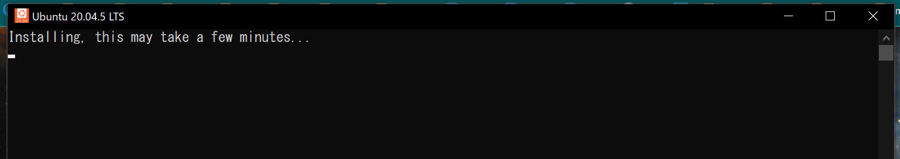
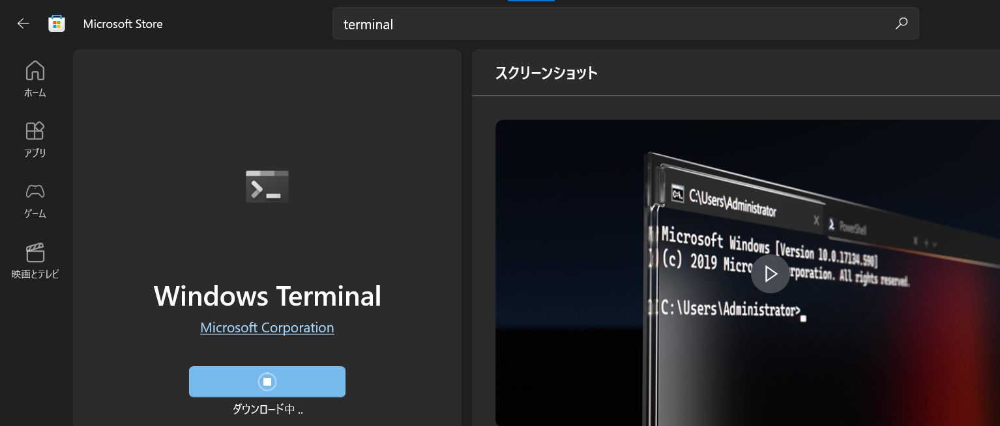
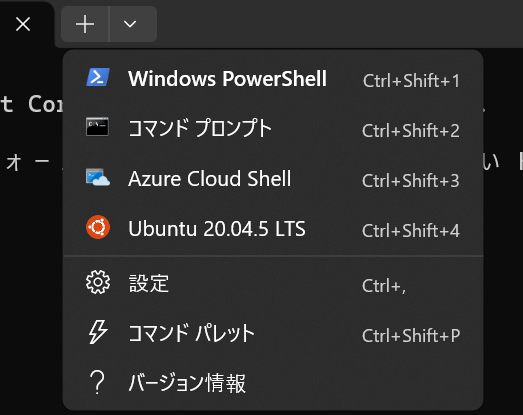
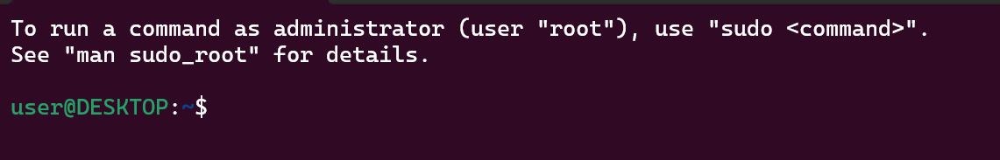
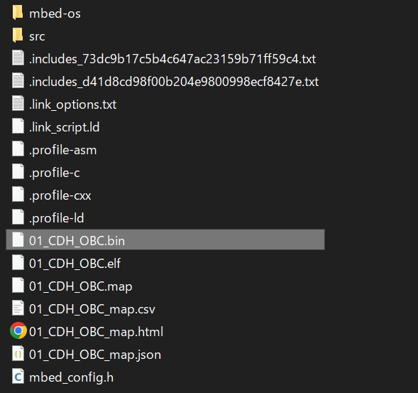
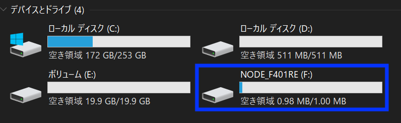

# 開発環境準備（ソフトウェア）: C系

Main OBC用ソフトウェアのビルド環境・ビルド実行・Main OBCへのインストールの方法について説明します。

# ビルド環境の準備

C系ソフトウェアのビルド環境は、WindowsのWindows Subsystem for Linux (WSL) という機能を使って構築します。

本作業は1時間〜数時間程度の時間がかかります。一度完了すれば、ほとんどの工程は繰り返す必要はありません。

すでに同様の環境およびツールがインストール済みの場合は、適宜スキップしてください。

## Ubuntuのインストール

### Linux機能の有効化

「Windowsの機能の有効化または無効化」を開きます。

「スタート」（Windowsマーク）をクリックし、そのまま半角入力モードで「windows」と入力します。すると、下図のように「Windowsの機能の有効化または無効化」が現れるので、それをクリックして開きます。



以下の2つの項目を見つけ、それぞれチェックマークを入れます:

- 「Linux用Windowsサブシステム」
- 「仮想マシン プラットフォーム」



その後、OKをクリックし、PCを再起動します。

### Ubuntuのインストールと初期化

PCの再起動後、Microsoft Storeを開きます。（上と同様に「スタート」から「store」と検索します）

「ubuntu 20.04」と検索し、「Ubuntu 20.04.5 LTS」を見つけます。

表示された「Ubuntu 20.04.5 LTS」の「入手」をクリックし、ダウンロード・インストールします。



完了すると、スタートメニューに「Ubuntu 20.04.5 LTS」が現れるので、それをクリックして起動します。

すると以下の画面が現れ、セットアップが開始します。ユーザー名とパスワードの入力が求められるので、半角入力モードで適宜入力・エンターを押して確定します。

- ユーザー名は、Ubuntuの使用時に用いられるものです。Windowsでのユーザー名と異なっても問題ありません。
- パスワード入力時は画面には文字が現れないことに注意してください。
- 入力したパスワードは後で使うので覚えておいてください。



セットアップ完了後、この画面を閉じます。

### Windows Terminalのインストール

Windows Terminalは、複数のターミナルソフトを一括して扱えるアプリです。上記で開いたUbuntu専用のターミナルよりも使い勝手が良いため、本稿ではこちらを使用します。

上と同様にMicrosoft Storeを開き、「terminal」と検索して「Windows Terminal」を見つけ、入手・インストールします。



インストール後はスタートメニューにWindows Terminalが追加されているので、それをクリックして起動します。

起動後、ウィンドウ中のタブの「+」の右横にある「`v`」ボタンをクリックし、以下のように複数の選択肢を表示します。このうち「Ubuntu 20.04.5 LTS」をクリックし、Ubuntuのターミナルを立ち上げます。



すると新しいタブが開き、`先程設定したユーザー名@PCの名前`の表示された行が現れます。



以下では、コマンドを実行する作業は全て、このWindows Terminal上の画面を使って行います。

## Ubuntuにおけるビルド環境の構築

C系ソフトウェアは、mbed-cliというツールを使ってビルドします。ここでは、それの実行に必要なソフトウェアを順次インストールします。

### ライブラリ・各種プログラムのインストール

上で開いたUbuntuの画面で以下を入力し、mbed-cliに必要なライブラリやプログラムをインストールします（`sudo apt ...`の行`#`部はコメントです）。行数が長いことに注意してください。

インストールには数分〜数十分程度の時間がかかります。なおパスワードが求められたら、ユーザーを設定した際に入力したパスワードを入力します。なおパスワード入力中に文字は何も表示されないことに注意してください。

```bash
# インストール元のリストを更新する
sudo apt update

# インストールを実行する
sudo apt install -y libffi-dev libssl-dev zlib1g-dev liblzma-dev tk-dev libbz2-dev libreadline-dev libsqlite3-dev libopencv-dev build-essential git mercurial gcc-arm-none-eabi
```

### pyenvのインストール

pyenvは、`mbed-cli`の適合するPythonのバージョンを管理するために使用します。

上の手順に続けて、Ubuntuの画面で以下を順に実行します:

```bash
git clone https://github.com/pyenv/pyenv.git ~/.pyenv
echo 'source ~/.bashrc' >> ~/.bash_profile
echo 'export PYENV_ROOT="$HOME/.pyenv"' >> ~/.bash_profile
echo 'export PATH="$PYENV_ROOT/bin:$PYENV_ROOT/shims:$PATH"' >> ~/.bash_profile
echo 'eval "$(pyenv init -)"' >> ~/.bash_profile
```

完了後、設定を更新するために、タブの`×`ボタンをクリックして現在の画面を閉じ、その後再度Ubuntuの画面を開きます。（タブ右横の「`v`」ボタン→「Ubuntu 20.04.5 LTS」をクリック）

そして以下を実行し、Pythonの指定バージョンをインストールします。これには数分程度の時間がかかります。

```bash
# Python 3.8.12をインストールする
pyenv install 3.8.12

# Python 3.8.12をこのPCで使うように設定する
pyenv global 3.8.12
```

完了後、同じ画面上で`python --version`と打ったときに`Python 3.8.12`と表示されれば成功です。

```bash
python --version
Python 3.8.12
```

### mbed-cliのインストール

以下のコマンドを実行すしてmbed-cliをインストールします。

```bash
pip install mbed-cli
```

完了後、同じ画面で`mbed`と打ったときに以下のような表示が見えれば成功です。

```text
usage: mbed [-h] [--version]             ...

Command-line code management tool for ARM mbed OS - http://www.mbed.com
version 1.10.5

Use "mbed <command> -h|--help" for detailed help.
Online manual and guide available at https://github.com/ARMmbed/mbed-cli
...
```

### ソースコードの取得と初期化

以下のコマンドを実行し、本稿の含まれるリポジトリ"hobby_sat_book"を取得します。

```bash
git clone https://github.com/RymanSatProject/hobby_sat_book.git
```

C系ソフトウェアが格納されたフォルダに移動します。

```bash
cd hobby_sat_book/01_CDH_OBC
```

`cd`コマンドの成功を確認するため、現在のフォルダの場所を表示する`pwd`コマンドを打って、`***/hobby_sat_book/01_CDH_OBC`のように表示されるか確認してください:

```bash
# 現在の自分の場所を表示する
pwd

# 例えば以下のように表示される
/home/user/hobby_sat_book/01_CDH_OBC
```

なお、同じ場所をエクスプローラで表示するには`explorer.exe .`を実行します。すると新しいエクスプローラのウィンドウが立ち上がり、`01_CDH_OBC`フォルダが現れるはずです。

確認ができたら、`mbed deploy`を実行し、Main OBCに必要なmbedのライブラリを取得します。これには10分程度の時間がかかります。

```bash
mbed deploy
```

完了すると、同じ場所に`mbed-os`というフォルダが生成され、その中にmbedライブラリのソースファイル群が見つかります。以下の様にコマンド`ls -l`を実行するとそれが見えます。

```bash
# mbed-osフォルダの中身を表示する
ls -l mbed-os
-rw-r--r--  1 user user    451 Mar 21 18:09 CONTRIBUTING.md
-rw-r--r--  1 user user    254 Mar 21 18:09 DOXYGEN_FRONTPAGE.md
-rw-r--r--  1 user user     73 Mar 21 18:09 Jenkinsfile
-rw-r--r--  1 user user   9115 Mar 21 18:09 LICENSE-apache-2.0.txt
-rw-r--r--  1 user user   3756 Mar 21 18:09 LICENSE.md
-rw-r--r--  1 user user   2927 Mar 21 18:09 README.md
drwxr-xr-x 21 user user   4096 Mar 21 18:09 TESTS
drwxr-xr-x  5 user user   4096 Mar 21 18:09 TEST_APPS
drwxr-xr-x 12 user user   4096 Mar 21 18:09 UNITTESTS
```

続いて以下を実行し、追加で必要なライブラリのインストールを実行します。

```bash
pip install -r mbed-os/requirements.txt
```

メッセージの最後に「WARNING: You are using pip version ...」と表示される場合がありますが無視して構いません。

# ビルドの実行

上に引き続き、`mbed compile`でプログラムのビルドを実行します。ビルドには数分程度の時間がかかります。

```text
# ビルド実行
mbed compile

# 以下のようなメッセージが順次表示される
[mbed] Working path "/home/user/01-book/hobby_sat_book/01_CDH_OBC" (program)

...
Compile [ 54.0%]: stm32f4xx_hal_mmc.c
Compile [ 54.3%]: stm32f4xx_hal_rcc.c
Compile [ 54.7%]: stm32f4xx_hal_sai.c
Compile [ 55.0%]: stm32f4xx_hal_pcd.c
...
```

以下のように、最終行に`Total Flash memory ...`と出力されればビルド成功です。

```text
...
Compile [100.0%]: terminal.cpp
Link: 01_CDH_OBC
Elf2Bin: 01_CDH_OBC
| Module | .text     | .data | .bss    |
| ------ | --------- | ----- | ------- |
| [fill] | 170(+170) | 6(+6) | 29(+29) |
...
| Subtotals        | 89100(+89100) | 2776(+2776) | 12880(+12880) |
Total Static RAM memory (data + bss): 15656(+15656) bytes
Total Flash memory (text + data): 91876(+91876) bytes

Image: ./BUILD/NUCLEO_F401RE/GCC_ARM-PROFILE/01_CDH_OBC.bin
```

もし、以下のエラー

```text
ImportError: cannot import name 'soft_unicode' from 'markupsafe'
```

が発生する場合は、以下の2行を順に実行してください（[参考](https://github.com/aws/aws-sam-cli/issues/3661)）:

```bash
pip uninstall MarkupSafe
pip install MarkupSafe==2.0.1
```

# OBCへのアップロード

上記のビルド成功メッセージの最終行にある`01_CDH_OBC.bin`が、Main OBCにアップロードするバイナリ（コンパイルされたプログラム）になります。まずは、これをエクスプローラで表示するため、現在のフォルダをエクスプローラで開いておきます。

上の作業と同じUbuntuの画面で、以下を実行します:

```bash
explorer.exe .
```

すると`01_CDH_OBC`フォルダがエクスプローラで表示されます。この中で`BUILD\NUCLEO_F401RE\GCC_ARM-PROFILE`をたどり、`01_CDH_OBC.bin`が見つかることを確認します。



続けて、Main Main OBCとPCをUSBケーブルで接続します。接続に成功すると、以下のようにエクスプローラで「NODE_F401RE」というドライブが見つかります。



これに、先程エクスプローラで表示させた`01_CDH_OBC.bin`をドラッグ&ドロップします。成功すると、OBC上部のLEDが赤と緑で数秒間点滅します。

## 動作確認

[sw-terminal.md](sw-terminal.md)を参考に、Tera TermでMain OBCに接続します。

接続後、Tera Termで文字出力が確認できれば成功です。たとえば、Main OBCがT系OBCに接続されていない場合は以下が継続的に出力されます:

```text
[ERR] transact: failed: cmd=0x10 ret=1
[ERR] comm.handshake: timeout
[ERR] transact: failed: cmd=0x10 ret=1
[ERR] comm.handshake: timeout
[ERR] transact: failed: cmd=0x10 ret=1
[ERR] comm.handshake: timeout
```
