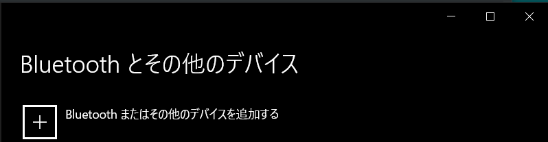
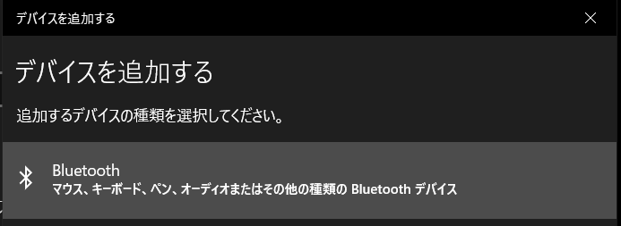

# 開発環境準備（ソフトウェア）: 通信: PCとのBluetooth接続

T系OBCとPCとのBluetooth接続の方法について説明します。

## T系OBCとPCの接続

T系OBCの電源を入れます。

PCの「設定」を開き、「デバイス」を選択します。

「Bluetoothまたはその他のデバイスを追加する」を選択します。

「デバイスを追加する」ウィンドウで「Bluetooth」を選択します。

「01-lite」を選択すると接続開始します。うまくいくと以下のようになるので、「完了」をクリックしてウィンドウを閉じます。

