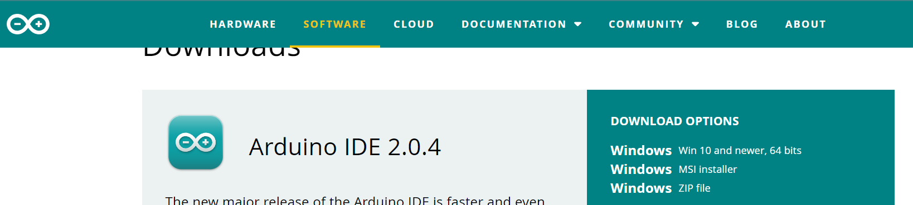
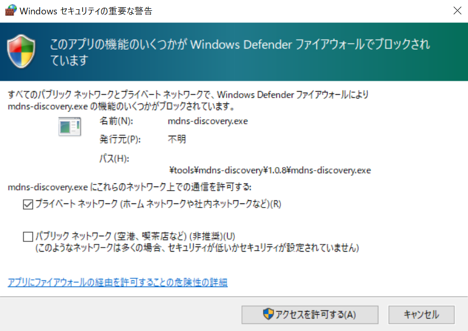
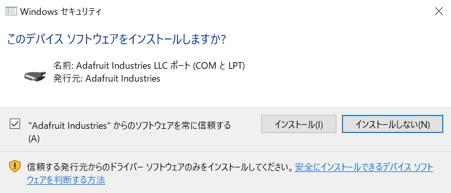
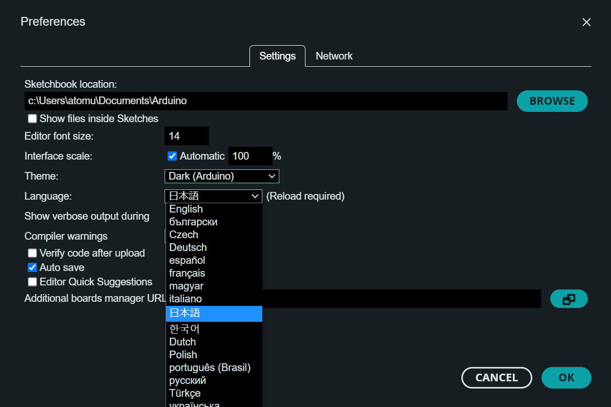
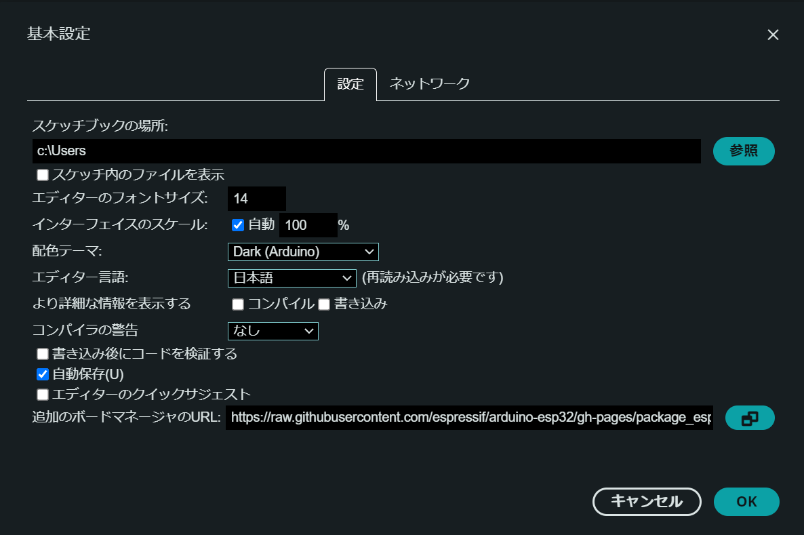
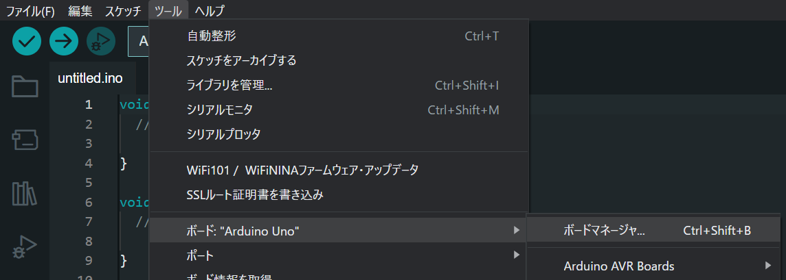
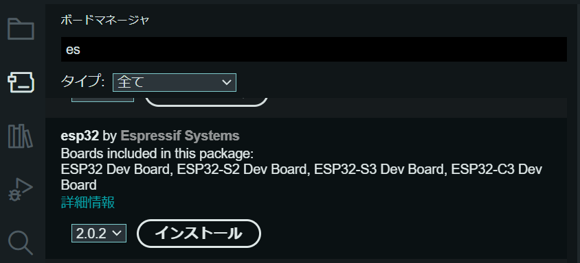
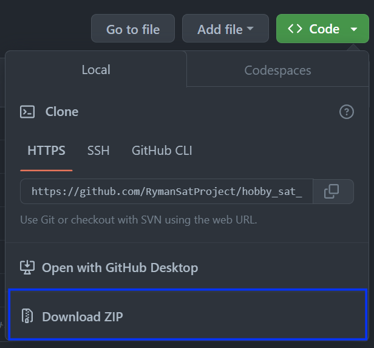
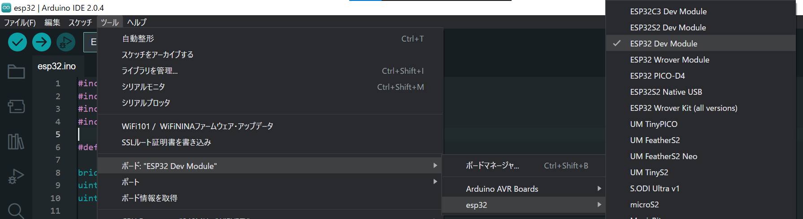
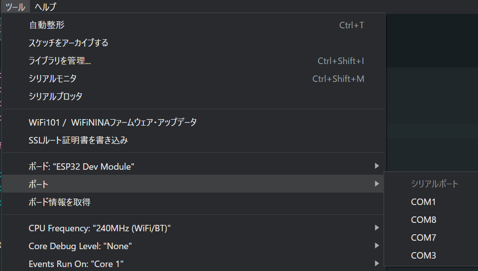

# 開発環境準備（ソフトウェア）: 通信

T系OBC用ソフトウェアのビルド環境・ビルド実行・T系OBCへのインストールの方法について説明します。

# ビルド環境の準備

通信ソフトウェアはArduinoライブラリを利用しています。これのビルドとT系OBCへのアップロードにはArduino IDEを使用します。

## Arduino IDEのインストール

[https://www.arduino.cc/en/software](https://www.arduino.cc/en/software) に行き、「DOWNLOAD OPTIONS」のうち「Windows Win 10 and newer, 64 bits」を選択してダウンロード・インストールします。



インストール後、スタートメニューから「Arduino IDE」をクリックして起動します。

起動後、以下の画面が現れたら、「プライベートネットワーク」の方にチェックを入れて「アクセスを許可する」をクリックします。



また、以下のようにいくつかインストールが求められますが、いずれも「インストール」を選択しておきます。



最後に、Arduino IDEのメニューバーで「File」→「Preferences」をクリックし、設定画面を開きます。

表示言語を日本語に変更するため、「Language」で「日本語」を選択して「OK」をクリックします。



するとArduino IDEが自動的に再起動し、表示が日本語に切り替わります。

## ライブラリの追加

通信ソフトウェアで利用されるarduino-esp32ライブラリインストールします。

[https://docs.espressif.com/projects/arduino-esp32/en/latest/installing.html](https://docs.espressif.com/projects/arduino-esp32/en/latest/installing.html) にアクセスし、「Stable release link」に記載されたURLをコピーします。（本稿執筆段階でのURLは`https://raw.githubusercontent.com/espressif/arduino-esp32/gh-pages/package_esp32_index.json`です）

続けて、Arduino IDEのメニューバーで「ファイル」→「基本設定...」をクリックし、設定画面を開きます。

「追加のボードマネージャのURL」に先程コピーしたURLを貼り付け、「OK」をクリックします。



その後、Arduino IDEのメニューバーで「ツール」→「ボード」→「ボードマネージャ」をクリックし、ボードマネージャを開きます。



この中から「esp32 by Espressif Systems」を見つけます（「es」と検索するとすぐに出てきます）。そして図のようにバージョン2.0.2を選択して「インストール」をクリックします。（クリックするとバージョン選択が元に戻りますが、インストールされるのは選択した2.0.2となります）



## ソースコードの取得

以下のいずれかの方法でソースコードを取得します。

### GitHubからzipファイルをダウンロードする

本GitHubページのトップで「Code」をクリックし、「Download ZIP」でzipファイルをダウンロード・解凍します。



### `git`コマンドを使う

[開発環境準備（ソフトウェア）: C系](sw-c.md)に記述のようにUbuntuを導入済みの場合は、`git`コマンドを使って**Windows側のファイルシステムに**リポジトリを取得できます。

```bash
# Windows側に移動する。移動先が「ドキュメント」フォルダの場合は以下
cd /mnt/c/Users/user/Documents

# リポジトリを取得
git clone https://github.com/RymanSatProject/hobby_sat_book.git
```

（**注意**: Arduino IDEは、WSL上のLinuxファイルシステム配下のソースファイルを開くことができません。ソースファイルはWindowsのファイルシスステム配下に直接置く必要があります。）

# ビルドの実行

エクスプローラで取得したフォルダ中の`03_Telecom_OBC\esp32\esp32.ino`をArduino IDEで開きます。

下図のように、Arduino IDEのメニューバーで「ツール」→「ボード」→「esp32」とたどり、「ESP32 Dev Module」をクリックします。



そして画面左上のチェックマークをクリックするか、`Ctrl + r` でビルドを実行します。ビルドには1分程度の時間がかかります。

画面下側の黒い出力画面で

```text
最大1310720バイトのフラッシュメモリのうち、スケッチが259073バイト（19%）を使っています。
最大327680バイトのRAMのうち、グローバル変数が19356バイト（5%）を使っていて、ローカル変数で308324バイト使うことができます。
```

のように出力されれば成功です。

# アップロード

まず、T系OBCをPCから外した状態で、Arduino IDEのメニューバーの「ツール」→「シリアルポート」にマウスを移動し、どのポートが存在するか確認します。



続けてT系OBCとPCをUSBケーブルで接続し、同じように「ツール」→「シリアルポート」を確認します。PCがESP32を正しく認識していると、下図のようにポートが1つ増えているはずです。

この新しく増えたポートをクリックし、書き込み先ポートを決定します。

ポートが追加されていない場合は、PCがT系OBCを認識していない可能性があります。この場合はT系OBCをPCから外し、再度接続してみてください。

続けて、画面左上の右矢印ボタンを押すか、`Ctrl + u`を押すと、プログラムのビルドとアップロードが始まります。

「出力」に

```text
Leaving...
Hard resetting via RTS pin...
```

と表示されれば書き込み成功です。
