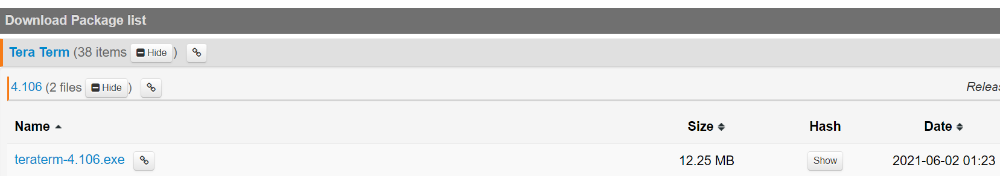
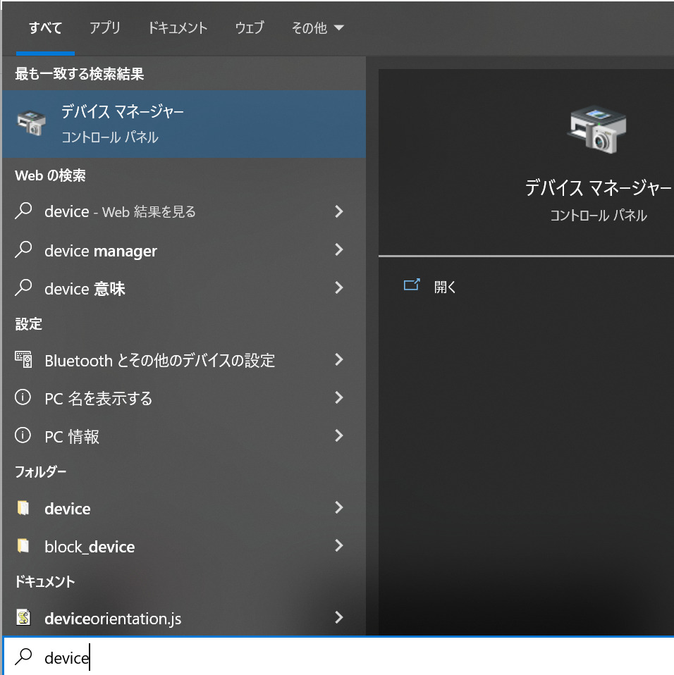
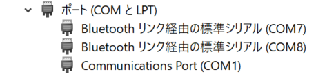
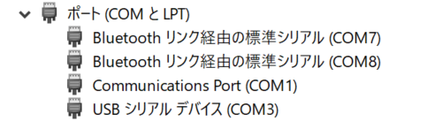
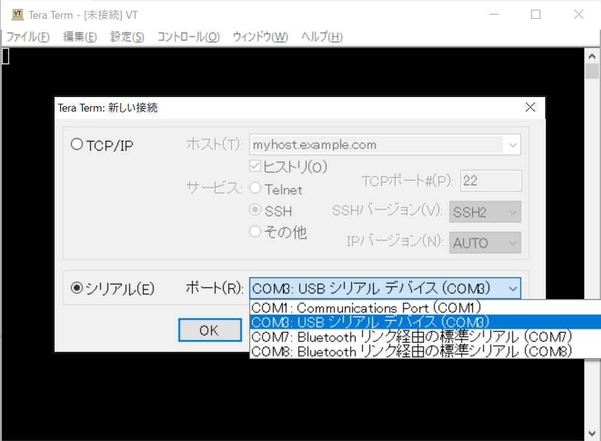
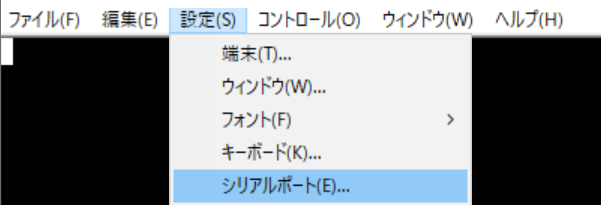
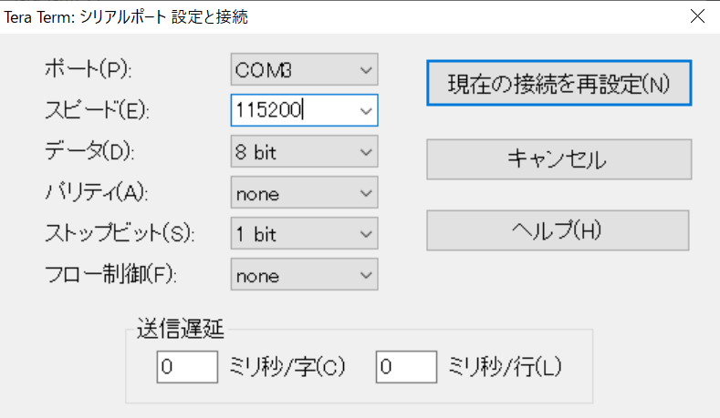

# 開発環境準備（ソフトウェア）: ターミナル

本文書は、OBCと有線で通信してログを取得するためのターミナルソフトであるTera Termの準備を行います。

## インストール

[https://osdn.net/projects/ttssh2/releases/](https://osdn.net/projects/ttssh2/releases/) にアクセスします。

ページ中の`teraterm-4.106.exe`をクリックし、インストーラをダウンロードします。

指示に従ってインストールを行います。

## 操作

（OBCへのバイナリ書き込みが完了してから参照ください）

### OBCのポート番号の取得

Tera Termを実行する前に、OBCの「ポート番号」を取得するための作業を行います。

OBCとPCが未接続の状態で、デバイスマネージャーを開きます。

「スタート」（Windowsマーク）をクリックし、そのまま半角入力モードで「device」と入力します。すると、下図のように「デバイス マネージャー」が現れるので、それをクリックして開きます。

「ポート（COMとLPT）」をダブルクリックして展開すると、以下のようにいくつかの項目が現れます（個数は環境によって異なります）。

このまま、OBCとPCをUSBケーブルで接続します。すると画面がリフレッシュされ、下図のように「ポート（COMとLPT）」にデバイスが1個追加されます。この追加されたデバイスのID「COM3」（番号は環境によって異なる）を覚えておきます。

### Tera Termの実行

デバイスマネージャーを閉じ、続けてTera Termを開きます。すると「Tera Term: 新しい接続」というウィンドウが同時に開きます。ここで「シリアル」を選択し、「ポート」に先程のID（上図の場合「COM3」）を選択します。選択後、OKを押します。

続けて、メニューバーの「設定」→「シリアルポート」をクリックし、ポートの設定画面を開きます。

「スピード」に半角で115200を入力し、「現在の接続を再設定」をクリックします。

これで、OBCとの通信が可能になります。
